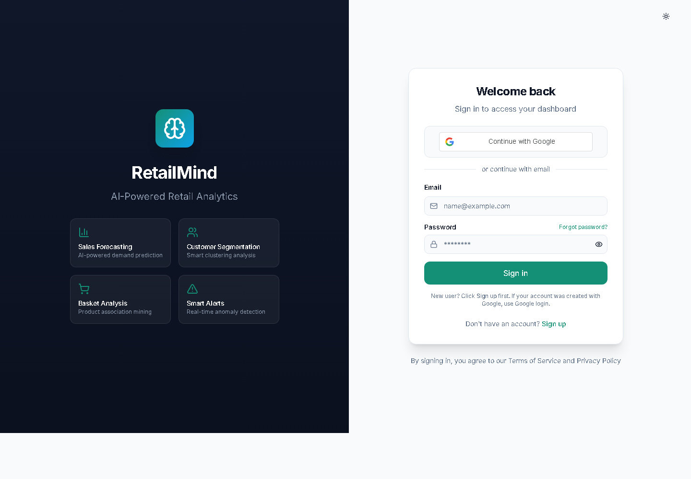
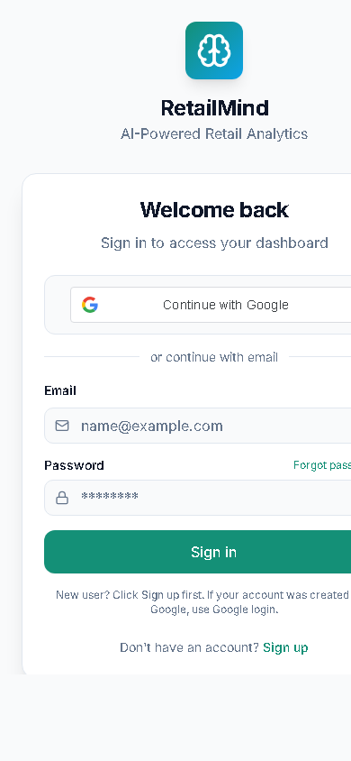

# RetailMind

RetailMind is a retail analytics and decision-support project built to show how raw sales, product, customer, and POS data can become practical business insight. It combines CSV ingestion, live POS capture, SQL-backed records, forecasting, customer segmentation, market basket analysis, realtime alerts, scheduled reporting, and AI-assisted analytics in one responsive dashboard.



## Why This Project Stands Out

- Built around business questions a retail analyst would answer: revenue movement, product performance, stock risk, customer behavior, and cross-sell opportunities.
- Supports both historical CSV uploads and live POS transaction capture, so static datasets and operational events feed the same analytics workflow.
- Uses Supabase Postgres, SQL migrations, typed clients, and realtime subscriptions to keep records structured and reviewable.
- Includes forecasting, customer segmentation, basket rules, alerts, reporting, PDF export, and AI chat for insight generation.
- Presents metrics through dashboard components such as KPI cards, sparklines, heatmaps, activity feeds, tables, and notification summaries.
- Documents setup, architecture, screenshots, security notes, and demo workflows for recruiter review.

## Screenshots

| Desktop login | Mobile login |
| --- | --- |
|  |  |

## Core Features

- **Authentication:** email/password sign up, password reset flow, profile sync, and Google sign-in.
- **Dashboard overview:** revenue, product metrics, activity feed, quick actions, sparklines, and heatmaps.
- **Sales forecasting:** trend-based demand forecasting from uploaded or POS-generated sales data.
- **Customer segmentation:** customer grouping and behavioural analysis for targeting.
- **Market basket analysis:** product association rules for bundling, layout, and cross-selling.
- **CSV upload and data management:** upload, validate, store, and review sales datasets.
- **Live POS:** seed demo products, scan/simulate barcodes, manage carts, update stock, and write POS sales records.
- **Realtime operations:** activity logs, notification bell, low-stock alerts, and transaction updates.
- **Goals and achievements:** track business goals and user progress.
- **Scheduled reports:** create report schedules and trigger email/report workflows.
- **AI assistant:** Supabase Edge Function integration for context-aware retail questions.

## Data Analyst Focus

- **Business KPIs:** revenue, transaction activity, product movement, stock status, customer behavior, and goal progress.
- **Data ingestion:** CSV uploads and live POS entries create analytics-ready sales records.
- **SQL data modeling:** Supabase migrations define operational tables for profiles, sales, products, POS, reports, goals, notifications, and audit-style activity.
- **Analytical methods:** forecasting for demand planning, segmentation for customer groups, and association analysis for basket recommendations.
- **Insight delivery:** dashboards, alerting, scheduled reports, PDF export, and AI-assisted Q&A help translate data into action.

## Tech Stack

| Layer | Technologies |
| --- | --- |
| Frontend | React 18, TypeScript, Vite, Tailwind CSS, shadcn/ui, Framer Motion |
| Data and auth | Supabase Auth, Supabase Postgres, Supabase Realtime, Supabase JS |
| Analytics | SQL, PostgreSQL, forecasting logic, customer segmentation, market basket analysis, KPI calculations |
| Analytics/UI | Recharts, TanStack Query, custom hooks, PDF export helpers |
| Serverless | Supabase Edge Functions for forecast, segmentation, basket, alerts, AI chat, POS, reports |
| Local backend | Flask, Pandas, NumPy, scikit-learn utilities |
| Tooling | ESLint, npm, Vite build pipeline |

## Architecture

```text
User
  |
  v
React + Vite dashboard
  |
  +-- Supabase Auth: email/password, Google login, sessions
  +-- Supabase Postgres: profiles, sales, products, POS, goals, reports, notifications
  +-- Supabase Realtime: live POS, alerts, activity updates
  +-- Supabase Edge Functions: analytics, AI chat, email/report workflows
  +-- Flask backend: optional local ML/API utilities
```

Detailed diagrams are available in [docs/system-diagrams.md](docs/system-diagrams.md).

## Project Structure

```text
retail-insight-hub/
|-- src/
|   |-- components/       # reusable UI and feature components
|   |-- contexts/         # auth, theme, notification state
|   |-- hooks/            # Supabase and API data hooks
|   |-- integrations/     # Supabase client and generated types
|   |-- lib/              # API client, validations, formatting, PDF export
|   `-- pages/            # login, auth callback, dashboard modules
|-- backend/              # optional Flask service
|-- supabase/
|   |-- functions/        # Edge Functions
|   `-- migrations/       # database schema migrations
|-- docs/
|   |-- screenshots/      # README screenshots
|   `-- system-diagrams.md
`-- public/
```

## Getting Started

### Prerequisites

- Node.js 18+
- npm
- A Supabase project
- Google Cloud OAuth client for Google sign-in
- Python 3.11+ only if running the optional Flask backend

### 1. Clone and Install

```bash
git clone https://github.com/Addi-20042/retail-insight-hub.git
cd retail-insight-hub
npm install
```

### 2. Configure Environment

Create `.env` from the template:

```bash
copy .env.example .env
```

Required frontend values:

```env
VITE_SUPABASE_URL=https://your-project-ref.supabase.co
VITE_SUPABASE_PUBLISHABLE_KEY=your-supabase-publishable-key
VITE_SUPABASE_ANON_KEY=your-supabase-anon-key
VITE_GOOGLE_CLIENT_ID=your-google-client-id.apps.googleusercontent.com
```

### 3. Run the Frontend

```bash
npm run dev
```

The app runs on:

- `http://localhost:8080`
- `http://127.0.0.1:8080`

Port `8080` is used intentionally because it is commonly added to Google OAuth authorized origins during local development.

### 4. Optional Flask Backend

```bash
cd backend
python -m venv venv
venv\Scripts\activate
pip install -r requirements.txt
python run_dev_server.py
```

Backend default URL:

```text
http://localhost:5000
```

## Supabase Setup Checklist

1. Create a Supabase project.
2. Apply the SQL migrations from `supabase/migrations/`.
3. Enable Google in `Authentication -> Providers -> Google`.
4. Add your Google OAuth client ID and client secret in Supabase.
5. Add allowed local origins in Google Cloud:
   - `http://localhost:8080`
   - `http://127.0.0.1:8080`
   - `http://localhost:8081`
   - `http://127.0.0.1:8081`
6. Deploy the needed Edge Functions from `supabase/functions/`.
7. Set Supabase function secrets for provider keys such as report email and AI gateway keys.

## Demo Workflow

1. Sign in using email/password or Google.
2. Go to `Dashboard -> Live POS`.
3. Click `Seed Demo Products`.
4. Click `Start Transaction`.
5. Use the simulate buttons or enter a demo barcode.
6. Watch the active cart, product stock, notifications, and analytics data update.

Demo barcodes:

| Barcode | Product |
| --- | --- |
| `8901030895489` | Basmati Rice 5kg |
| `8906008100012` | Sunflower Oil 1L |
| `8901719123456` | Digestive Biscuits |
| `8901491102233` | Bath Soap Pack |
| `8902080007654` | Toned Milk 1L |

## Quality Checks

```bash
npm run lint
npm run build
```

Current verification status:

- Production build passes.
- ESLint runs with zero errors. Some Fast Refresh and hook dependency warnings remain from existing component export patterns.
- Login page verified locally on `http://localhost:8080/login` and `http://127.0.0.1:8080/login`.

## What I Learned / Engineering Highlights

- Translating retail business questions into measurable KPIs, charts, alerts, and reports.
- Modeling sales, products, profiles, POS transactions, reports, and notifications in SQL-backed tables.
- Designing analytics workflows for forecasting, segmentation, and basket analysis.
- Creating practical POS flows that write transaction data back into analytics pipelines.
- Balancing data storytelling, responsive layouts, and operational workflows in React.

## Roadmap

- Add a hosted production demo link.
- Add automated end-to-end tests for auth, upload, POS, and dashboard flows.
- Add CI with build, lint, and secret scanning.
- Improve chunk splitting for large production bundles.
- Expand inventory optimization and reorder recommendations.
- Add multi-store analytics and comparative reports.

## Security Notes

- `.env`, backend secrets, build artifacts, logs, and virtual environments are ignored by git.
- Google client secrets, Supabase service-role keys, email provider keys, and AI provider keys must stay in provider dashboards or GitHub/Supabase secrets.
- Public browser keys such as Supabase anon/publishable keys still rely on Supabase Row Level Security and policies for data protection.

## Author

Built by [Addi-20042](https://github.com/Addi-20042) as a data analyst portfolio project with full-stack implementation.

## License

This project is licensed under the [MIT License](LICENSE).
