# Retail Insight Hub Diagrams (Mermaid)

## 2) DFD Level 0 (Context)
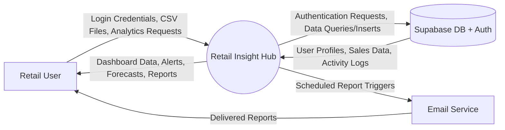

## 3) DFD Level 1
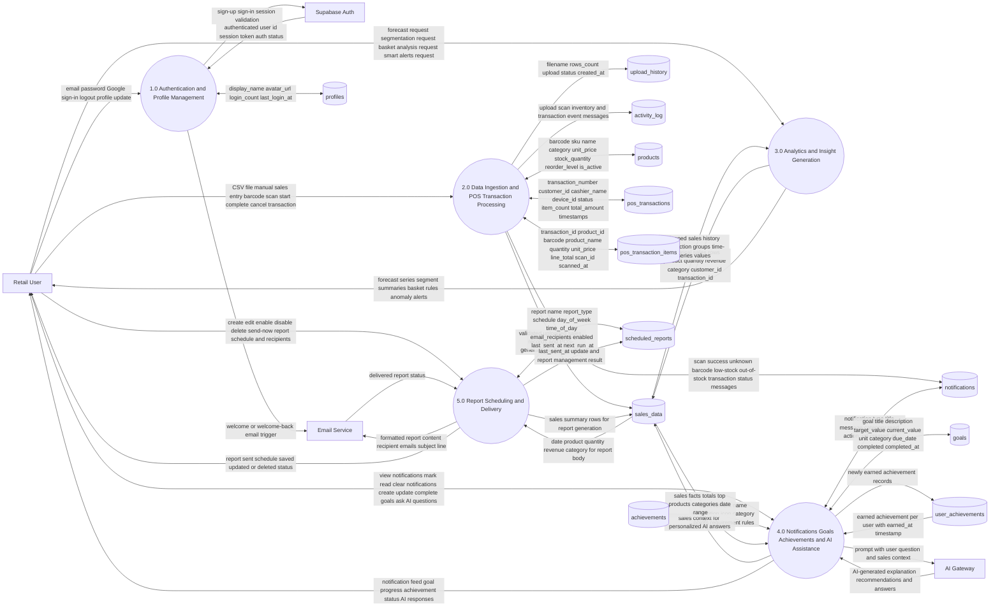

**DFD Level 1 Data Store Contents**

- `D1 profiles`: `id`, `user_id`, `display_name`, `avatar_url`, `login_count`, `last_login_at`, `created_at`, `updated_at`
- `D2 sales_data`: `id`, `user_id`, `product_id`, `date`, `product`, `quantity`, `revenue`, `category`, `customer_id`, `transaction_id`, `barcode`, `source`, `device_id`, `transaction_status`, `created_at`
- `D3 upload_history`: `id`, `user_id`, `filename`, `rows_count`, `status`, `created_at`
- `D4 activity_log`: `id`, `user_id`, `type`, `message`, `created_at`
- `D5 products`: `id`, `user_id`, `barcode`, `sku`, `name`, `category`, `unit_price`, `stock_quantity`, `reorder_level`, `is_active`, `created_at`, `updated_at`
- `D6 pos_transactions`: `id`, `user_id`, `transaction_number`, `customer_id`, `cashier_name`, `device_id`, `status`, `item_count`, `total_amount`, `started_at`, `completed_at`, `created_at`, `updated_at`
- `D7 pos_transaction_items`: `id`, `user_id`, `transaction_id`, `product_id`, `barcode`, `product_name`, `quantity`, `unit_price`, `line_total`, `scan_id`, `scanned_at`, `created_at`
- `D8 notifications`: `id`, `user_id`, `type`, `title`, `message`, `category`, `read`, `action_url`, `created_at`
- `D9 goals`: `id`, `user_id`, `title`, `description`, `target_value`, `current_value`, `unit`, `category`, `due_date`, `completed`, `completed_at`, `created_at`, `updated_at`
- `D10 achievements`: `id`, `name`, `description`, `icon`, `category`, `points`, `requirement_type`, `requirement_value`
- `D11 user_achievements`: `id`, `user_id`, `achievement_id`, `earned_at`
- `D12 scheduled_reports`: `id`, `user_id`, `name`, `report_type`, `schedule`, `day_of_week`, `time_of_day`, `email_recipients`, `enabled`, `last_sent_at`, `next_run_at`, `created_at`, `updated_at`

**How Data Moves Across the 5 Processes**

- `1.0 Authentication and Profile Management`: user credentials go from `Retail User` to the authentication process, the process validates them through `Supabase Auth`, then reads or updates `profiles` and triggers the welcome or welcome-back email flow.
- `2.0 Data Ingestion and POS Transaction Processing`: CSV rows, manual entries, and barcode scans are validated and then stored mainly in `sales_data`; POS also reads and updates `products`, `pos_transactions`, and `pos_transaction_items`, while upload status goes to `upload_history`, events go to `activity_log`, and operational messages go to `notifications`.
- `3.0 Analytics and Insight Generation`: forecast, segmentation, basket analysis, and smart alerts read historical rows from `sales_data` and return computed insight data directly to the user.
- `4.0 Notifications Goals Achievements and AI Assistance`: the user reads and manages `notifications`, creates and completes `goals`, earns rows in `user_achievements` based on rules in `achievements`, and sends AI questions that are enriched with facts read from `sales_data` before being sent to the external AI service.
- `5.0 Report Scheduling and Delivery`: report schedules are stored in `scheduled_reports`; when a report is generated, this process reads summary data from `sales_data`, sends formatted content to the external email service, then writes the latest send status back to `scheduled_reports`.

**Implementation Notes**

- `sales_data` is the central fact store of the system. Both uploaded CSV records and POS sales scans are stored here, which is why analytics, AI answers, and reports all depend on `sales_data`.
- `chat_messages` exists in the schema, but the current AI chat flow shown in the code reads `sales_data` and calls the external AI service without persisting chat messages to that table.
- Smart alerts are generated analytically from `sales_data`, while operational POS alerts such as unknown barcode, low stock, or out-of-stock are written into `notifications`.

## 3.1) DFD Level 1 - Component 1: Authentication and Profile Management
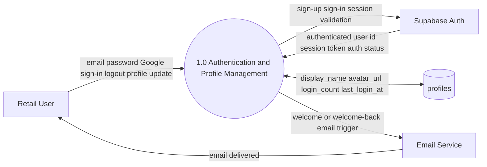

**Data Flows for Component 1:**

| From | To | Data Type | Description |
|------|----|-----------| ------------|
| Retail User | P1 | Credentials | email, password, OAuth provider selection |
| P1 | Supabase Auth | Auth Request | sign-up, sign-in, session validation |
| Supabase Auth | P1 | Auth Response | authenticated user id, session token, auth status |
| P1 | D1 (profiles) | Profile Data | display_name, avatar_url, login_count, last_login_at |
| D1 (profiles) | P1 | Profile Data | read user profile on login |
| P1 | Email Service | Email Trigger | welcome email for new users, welcome-back for returning |
| Email Service | Retail User | Confirmation Email | email confirmation link or welcome message |

**Key Characteristics:**
- Single entry point for all authentication flows (email, password, Google OAuth)
- All user profile metadata stored and updated here
- Direct integration with Supabase Auth for session management
- Triggers welcome email notifications via external email service

---

## 3.2) DFD Level 1 - Component 2: Data Ingestion and POS Transaction Processing (Simplified - 5 Parts)

### 2.1) Excel File Upload - When You Upload Sales from a File
```mermaid
flowchart LR
    U["👤 You"] -->|"Upload a CSV file<br/>(Excel spreadsheet)| P2["⚙️ System"]
    P2 -->|"Checks & Saves<br/>all sales records"| D2["💾 Sales List"]
    P2 -->|"Remembers the upload<br/>(filename, count, status)"| D3["📋 Upload History"]
    P2 -->|"Logs what happened<br/>(for records)"| D4["📝 Activity Log"]
```

**Simple Explanation:**
1. You upload an Excel file with sales data
2. System checks if it's valid and saves all the sales
3. System remembers: what file you uploaded, how many sales, whether it worked
4. System keeps a record of this action (for history/audit)

---

### 2.2) Typing Sales Directly - When You Manually Enter a Sale
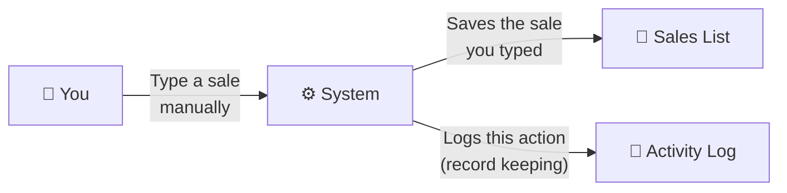

**Simple Explanation:**
1. You type in a new sale directly (without uploading a file)
2. System saves it to the main sales list
3. System records that you did this

---

### 2.3) Managing Your Products - When You Add/Update Products
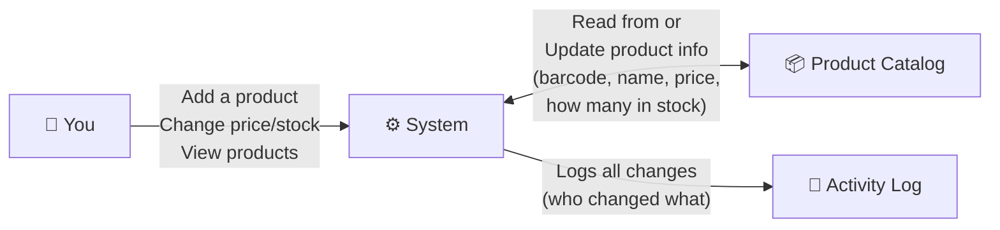

**Simple Explanation:**
1. You add a new product or update existing product info (price, stock, name)
2. System updates your product list
3. System keeps track of all changes for history

---

### 2.4) Barcode Scanning at Checkout - The Main POS Flow
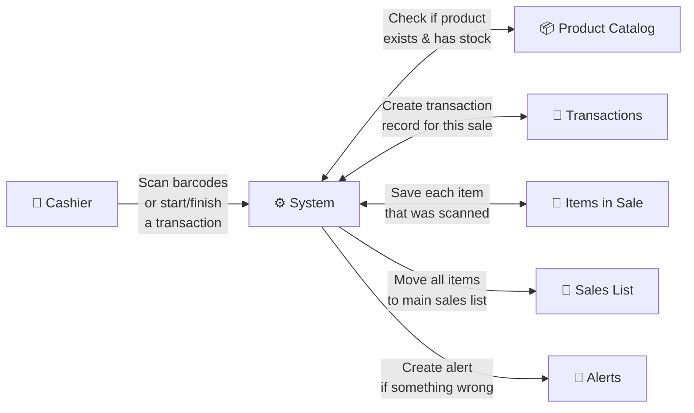

**Simple Explanation - Step by Step:**
1. Cashier scans a barcode (or starts/completes a transaction)
2. System checks: "Do we have this product? Is it in stock?"
3. System creates a receipt/transaction record
4. System records each item scanned
5. When transaction is done, system saves all items to the main sales list
6. If there's a problem (unknown barcode, out of stock), system creates a warning

---

### 2.5) Alerts & Messages - When Something Needs Your Attention
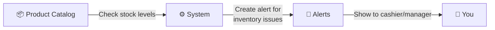

**Common Alerts You'll See:**
- ❌ **Unknown Barcode** - "This barcode doesn't exist in our system"
- 📉 **Out of Stock** - "This product is sold out"
- ⚠️ **Low Stock** - "We only have 3 left, reorder needed"
- ✅ **Sale Complete** - "Transaction finished successfully"

---

## 📊 Where Does Your Data Go? (All 8 Storage Areas)

| Storage Name | What It Stores | Real-World Example |
|---|---|---|
| **Sales List** | Every sale from any source | "Coffee sold yesterday for $5" |
| **Upload History** | Details about file uploads | "Uploaded Monday morning file with 50 sales" |
| **Activity Log** | Record of everything that happens | "John uploaded file at 9:00 AM" |
| **Product Catalog** | Your product information | "Coffee - $5 - 100 in stock" |
| **Transactions** | Receipt/transaction data | "Transaction #123 - 3 items - $15 total" |
| **Items in Sale** | Each item scanned | "Coffee x2 at $5 each" |
| **Alerts** | Warning messages | "Coffee is now out of stock!" |

---

## 🎯 How It All Works Together

**The Big Picture:**
- Sales come from 3 places: Excel uploads, manual typing, or barcode scanning
- All sales go into ONE main "Sales List" 
- Products are checked every time a barcode is scanned
- Problems create instant alerts so you know right away
- Everything is recorded for history/compliance

**Key Points:**
✅ One place to see ALL sales (no matter where they came from)  
✅ Automatic checking - can't scan a product that doesn't exist  
✅ Real-time alerts - problems show up immediately  
✅ Full history - you can see who did what and when

---

## 3.3) DFD Level 1 - Component 3: Analytics and Insight Generation
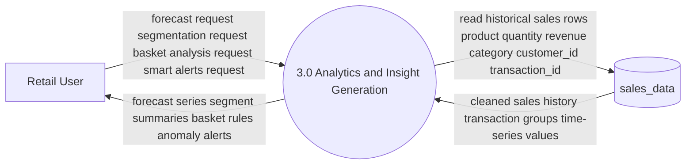

**Data Flows for Component 3:**

| From | To | Data Type | Description |
|------|----|-----------| ------------|
| Retail User | P3 | Request | forecast request, segmentation request, basket analysis request, smart alerts request |
| P3 | D2 (sales_data) | Query Request | historical sales rows filtered by user_id, date range |
| D2 (sales_data) | P3 | Raw Sales Data | product, quantity, revenue, category, customer_id, transaction_id, date, barcode |
| P3 | P3 | Data Processing | data cleaning, normalization, feature engineering, transformation to pandas DataFrame |
| P3 | P3 | ML Model Execution | run forecast model, segmentation clustering, basket association rules, anomaly detection |
| P3 | Retail User | Forecast Results | time-series forecast data, confidence intervals, predicted quantities and revenue |
| P3 | Retail User | Segment Results | customer clusters, segment profiles, segment size, segment-specific metrics |
| P3 | Retail User | Basket Results | association rules, product affinity, support/confidence/lift metrics |
| P3 | Retail User | Alert Results | anomaly alerts, threshold violations, trend alerts, outlier transactions |

**Key Characteristics:**
- Read-only access to historical `sales_data`
- All analytics computations done in-memory on backend
- No persistent storage of intermediate results (results computed on-demand)
- Supports 4 main analytics types: forecast, segmentation, basket analysis, smart alerts
- Results returned directly to user UI for visualization
- Can trigger from P2 (Data Ingestion) when new sales uploaded, or on-demand by user

---

## 3.4) DFD Level 1 - Component 4: Notifications, Goals, Achievements, and AI Assistance
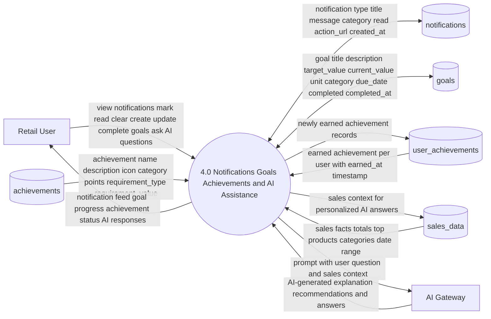

**Data Flows for Component 4:**

| From | To | Data Type | Description |
|------|----|-----------| ------------|
| Retail User | P4 | Action | view notifications, mark read, clear notifications |
| P4 | D8 (notifications) | Query | retrieve notifications for user_id |
| D8 (notifications) | P4 | Notification Data | type, title, message, category, read status, action_url, created_at |
| P4 | D8 (notifications) | Update | mark notification as read, delete notification |
| Retail User | P4 | Action | create goal, update goal progress, complete goal |
| P4 | D9 (goals) | Query | retrieve goals for user_id |
| D9 (goals) | P4 | Goal Data | title, description, target_value, current_value, unit, category, due_date, completion status |
| P4 | D9 (goals) | Mutation | insert new goal, update current_value, mark completed, update timestamps |
| P4 | D10 (achievements) | Query | read achievement definitions |
| D10 (achievements) | P4 | Achievement Data | name, description, icon, category, points, requirement_type, requirement_value |
| P4 | D11 (user_achievements) | Check | verify if user earned achievement |
| P4 | D11 (user_achievements) | Insert | award achievement to user on earned_at timestamp |
| D11 (user_achievements) | P4 | Earned Data | earned achievement id, earned_at timestamp |
| P4 | D2 (sales_data) | Query | read user's sales history for context |
| D2 (sales_data) | P4 | Sales Context | sales facts, totals, top products, categories, date range summary |
| Retail User | P4 | AI Question | ask AI question about sales, business insights, recommendations |
| P4 | AI Gateway | Prompt | user question + enriched sales context + user profile |
| AI Gateway | P4 | AI Response | AI-generated explanation, recommendations, actionable insights |
| P4 | Retail User | Feedback | notification feed, goal progress updates, achievement notifications, AI responses |

**Key Characteristics:**
- Centralized hub for user engagement features (notifications, goals, achievements)
- AI assistant enriched with user's sales data for personalized responses
- Goals tracked with current progress against targets
- Achievement system with unlock conditions and points
- Notifications span multiple sources: POS alerts, goal milestones, achievement unlocks, system messages
- All user interactions logged for activity feed

---

## 3.5) DFD Level 1 - Component 5: Report Scheduling and Delivery
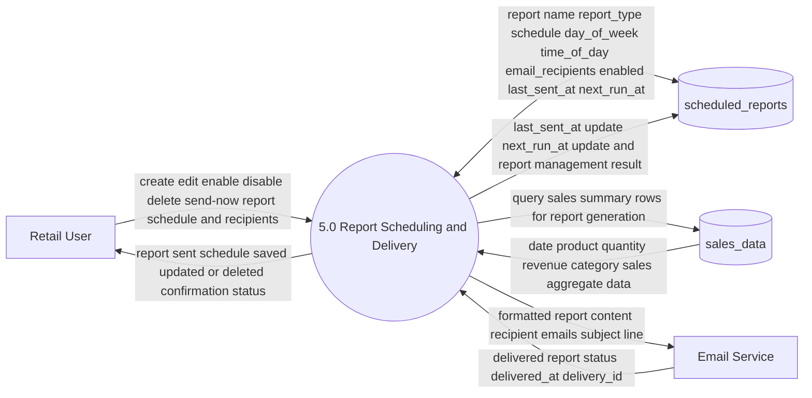

**Data Flows for Component 5:**

| From | To | Data Type | Description |
|------|----|-----------| ------------|
| Retail User | P5 | Action | create schedule, edit schedule, enable/disable, delete schedule, send report now |
| P5 | D12 (scheduled_reports) | Query | retrieve scheduled reports for user_id |
| D12 (scheduled_reports) | P5 | Schedule Data | report name, report_type, schedule (daily/weekly/monthly), day_of_week, time_of_day, email_recipients, enabled status |
| P5 | D12 (scheduled_reports) | Insert | create new scheduled report with initial configuration |
| P5 | D12 (scheduled_reports) | Update | modify schedule settings, update enabled status, update email_recipients |
| P5 | D12 (scheduled_reports) | Delete | delete scheduled report |
| P5 | D2 (sales_data) | Query | fetch sales data for report period (daily, weekly, or monthly aggregation) |
| D2 (sales_data) | P5 | Sales Data | date, product, quantity, revenue, category aggregated per report type |
| P5 | P5 | Report Generation | aggregate sales data by date/product/category, calculate totals and summaries |
| P5 | Email Service | Email Payload | formatted report content (HTML/PDF), recipient email list, subject line, from address |
| Email Service | P5 | Delivery Status | delivery status (sent/failed), delivery_id, timestamp |
| P5 | D12 (scheduled_reports) | Update | update last_sent_at, calculate next_run_at based on schedule |
| P5 | Retail User | Confirmation | report schedule created/updated/deleted/sent confirmation |
| P5 | Retail User | Report | email scheduled report or on-demand report delivery (via Email Service) |

**Key Characteristics:**
- Flexible scheduling system (daily, weekly, monthly reports)
- Multiple recipient support per report
- Report generation on-demand or automatically via scheduler
- Sales data aggregation per report type
- Email service integration for delivery
- Tracking of last send time and next scheduled send time
- Audit trail for all report schedule changes
- Users can manage all report configurations and trigger on-demand sends

---

## 5) Use Case Diagram
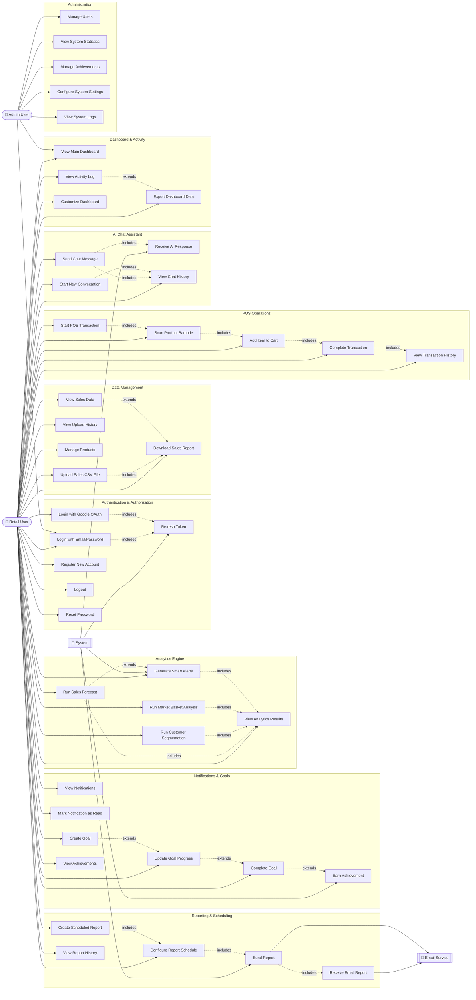

**Legend:**
- **Solid Arrow (-->)**: Primary actor uses the use case
- **Dotted Arrow (-.->|includes|)**: One use case includes another (required behavior)
- **Dotted Arrow (-.->|extends|)**: One use case extends another (optional behavior)
- **Blue Boxes**: Grouping of related use cases by domain
- **Actors**: 👤 = User, 🔧 = System, 📧 = External Service

**Actor Descriptions:**
- **Retail User**: Primary actor who performs sales/analytics operations
- **Admin User**: Secondary actor with elevated permissions for system management
- **System**: Automated internal processes (token refresh, alerts generation, achievement validation)
- **Email Service**: External system for report delivery

## 6) Activity Diagram (With Database Interactions)
```mermaid
flowchart TD
    start((Start))
    DB[(Supabase Database)]

    subgraph AuthFlow["Authentication Flow"]
        A1[User opens app]
        A2[Display login/register page]
        A3{User has account?}
        A4[Enter credentials]
        A5{Existing or New?}
        A6[Register new account]
        A7[Send email validation]
        A8[Login with email/password]
        A9[Send to Supabase Auth]
        A10{Valid credentials?}
        A11[Authentication failed]
        A12[Create session token]
        A13[Load user profile]
        A14[Navigate to dashboard]
    end

    subgraph DataUploadFlow["Data Upload & Processing Flow"]
        D1[User selects CSV file]
        D2[Parse CSV contents]
        D3{CSV format valid?}
        D4[Show validation error]
        D5[Validate data integrity]
        D6{Data quality OK?}
        D7[Insert batch into sales_data]
        D8[Record upload_history]
        D9[Update activity_log]
        D10[Trigger analytics pipeline]
        D11[Show upload success]
    end

    subgraph AnalyticsFlow["Analytics & Insight Generation"]
        E1{Which analysis?}
        E2[Run sales forecast]
        E3[Run customer segmentation]
        E4[Run market basket analysis]
        E5[Run smart alerts]
        E6[Fetch historical sales data]
        E7[Process & compute models]
        E8[Save/cache results]
        E9[Display analytics charts]
    end

    subgraph GoalsNotificationsFlow["Goals, Notifications & Achievements"]
        N1[Open goals panel]
        N2{User action?}
        N3[Create new goal]
        N4[Insert goal into DB]
        N5[View notification]
        N6[Mark as read]
        N7[Update notification status]
        N8[Check achievement rules]
        N9{Milestone earned?}
        N10[Insert user_achievement]
        N11[Create achievement notification]
        N12[Refresh goal/notification UI]
    end

    subgraph ReportingFlow["Report Scheduling & Delivery"]
        R1[Configure report settings]
        R2[Set schedule/recipients]
        R3[Save to scheduled_reports]
        R4[Report trigger event]
        R5[Query sales_data]
        R6[Generate report document]
        R7[Send via email service]
        R8{Email sent?}
        R9[Update scheduled_reports status]
        R10[Log completion]
    end

    subgraph POSFlow["POS Transaction Flow"]
        P1[Cashier starts POS]
        P2[Create pos_transaction]
        P3[Insert transaction record]
        P4[Scan product barcode]
        P5[Lookup in products table]
        P6{Product exists?}
        P7[Check stock quantity]
        P8{In stock?}
        P9[Add to pos_transaction_items]
        P10[More items?]
        P11[Complete transaction]
        P12[Insert into sales_data]
        P13[Update product stock]
        P14[Show receipt/confirmation]
    end

    subgraph ChatFlow["AI Chat Assistant"]
        C1[Open chat interface]
        C2[User sends message]
        C3[Fetch sales context from DB]
        C4[Send to AI service]
        C5[AI generates response]
        C6[Store chat message]
        C7[Display response]
    end

    subgraph AdminFlow["Administration"]
        M1[Admin logs in]
        M2[Verify admin role in DB]
        M3{Admin action?}
        M4[View system statistics]
        M5[Query metrics from DB]
        M6[Manage achievements/rules]
        M7[Update achievements table]
        M8[View activity logs]
        M9[Query activity_log]
    end

    %% Authentication flow
    start --> A1 --> A2 --> A3
    A3 -->|No| A6
    A3 -->|Yes| A4
    A4 --> A5
    A5 -->|Register| A7
    A5 -->|Login| A8
    A7 --> A9
    A8 --> A9
    A9 -->|Query| DB
    DB -->|Verify| A9
    A9 --> A10
    A10 -->|Invalid| A11 --> A2
    A10 -->|Valid| A12 --> A13
    A13 -->|Read| DB
    DB -->|Profile data| A13
    A13 --> A14

    %% Data upload flow
    A14 --> D1 --> D2 --> D3
    D3 -->|No| D4 --> D1
    D3 -->|Yes| D5 --> D6
    D6 -->|No| D4
    D6 -->|Yes| D7
    D7 -->|INSERT| DB
    DB -->|Confirm| D8
    D8 -->|INSERT| DB
    D9 -->|INSERT| DB
    DB -->|Confirm| D9
    D10 --> E1
    A14 --> D11

    %% Share database after upload
    D7 --> E6
    D8 --> E6
    D9 --> E6

    %% Analytics flow
    A14 --> E1
    E1 -->|Forecast| E2
    E1 -->|Segmentation| E3
    E1 -->|Basket| E4
    E1 -->|Alerts| E5
    E2 --> E6
    E3 --> E6
    E4 --> E6
    E5 --> E6
    E6 -->|SELECT| DB
    DB -->|sales_data| E6
    E6 --> E7 --> E8
    E8 -->|SAVE| DB
    DB -->|Confirm| E9

    %% Goals & notifications flow
    A14 --> N1
    E9 --> N1
    N1 --> N2
    N2 -->|Create| N3 --> N4
    N4 -->|INSERT| DB
    DB -->|Confirm| N12
    N2 -->|View| N5 --> N6
    N6 -->|UPDATE| DB
    DB -->|Confirm| N7 --> N12
    N12 --> N8
    N8 --> N9
    N9 -->|Yes| N10
    N10 -->|INSERT| DB
    DB -->|Confirm| N11
    N9 -->|No| N12

    %% Reporting flow
    A14 --> R1 --> R2 --> R3
    R3 -->|INSERT| DB
    DB -->|Confirm| R4
    R4 --> R5
    R5 -->|SELECT| DB
    DB -->|sales data| R6
    R6 --> R7 --> R8
    R8 -->|Success| R9
    R9 -->|UPDATE| DB
    DB -->|Confirm| R10

    %% POS flow
    A14 --> P1 --> P2 --> P3
    P3 -->|INSERT| DB
    DB -->|transaction_id| P4
    P4 --> P5
    P5 -->|SELECT| DB
    DB -->|product data| P6
    P6 -->|Not found| P5
    P6 -->|Found| P7
    P7 -->|SELECT| DB
    DB -->|stock qty| P8
    P8 -->|Out of stock| P5
    P8 -->|In stock| P9
    P9 -->|INSERT| DB
    DB -->|Confirm| P10
    P10 -->|Yes| P4
    P10 -->|No| P11 --> P12
    P12 -->|INSERT| DB
    DB -->|Confirm| P13
    P13 -->|UPDATE| DB
    DB -->|Confirm| P14

    %% Chat flow
    A14 --> C1 --> C2
    C2 --> C3
    C3 -->|SELECT| DB
    DB -->|sales context| C4
    C4 --> C5 --> C6
    C6 -->|INSERT| DB
    DB -->|Confirm| C7

    %% Admin flow
    A14 --> M1 --> M2
    M2 -->|SELECT| DB
    DB -->|role check| M3
    M3 -->|Stats| M4 --> M5
    M5 -->|SELECT| DB
    DB -->|metrics| M4
    M3 -->|Achievements| M6 --> M7
    M7 -->|UPDATE| DB
    DB -->|Confirm| M8
    M3 -->|Logs| M8 --> M9
    M9 -->|SELECT| DB
    DB -->|log data| M8

    %% End states
    D11 --> end((End))
    E9 --> end
    N12 --> end
    R10 --> end
    P14 --> end
    C7 --> end
    M8 --> end
    A11 --> end

    style DB fill:#fce4ec,stroke:#c2185b,stroke-width:3px
    style AuthFlow fill:#e3f2fd
    style DataUploadFlow fill:#f3e5f5
    style AnalyticsFlow fill:#e8f5e9
    style GoalsNotificationsFlow fill:#fff3e0
    style ReportingFlow fill:#fce4ec
    style POSFlow fill:#f1f8e9
    style ChatFlow fill:#e0f2f1
    style AdminFlow fill:#ede7f6
```

**Activity Diagram Legend:**
- **Pink (Database)**: Supabase interactions with query/insert/update operations
- **Blue (Auth)**: Authentication and session management
- **Purple (Data Upload)**: CSV file processing and data ingestion
- **Green (Analytics)**: Analytics computation and model execution
- **Orange (Goals)**: Goals and achievement management
- **Pink subset (Reports)**: Report scheduling and delivery
- **Light Green (POS)**: Point of sale transaction processing
- **Teal (Chat)**: AI chat assistant interactions
- **Light Purple (Admin)**: Administration and system management

**Key Database Operations Shown:**
- `INSERT` → Write new data
- `SELECT` → Query/read data
- `UPDATE` → Modify existing data
- Each DB operation has confirmation feedback

## 7) Comprehensive Sequence Diagram (All Flows with Details)
```mermaid
sequenceDiagram
    autonumber
    participant U as Retail User
    participant FE as Frontend (React)
    participant API as Backend API (Flask)
    participant SB as Supabase Database
    participant Auth as Supabase Auth
    participant ML as ML Analytics Engine
    participant Email as Email Service
    participant AI as AI Chat Service
    participant Realtime as Realtime Listener

    %% ========== FLOW 1: AUTHENTICATION & SESSION ==========
    rect rgb(200, 230, 255)
      Note over U,Realtime: FLOW 1: AUTHENTICATION & SESSION MANAGEMENT
      U->>FE: Click app / page load
      FE->>FE: Check localStorage for session token
      
      alt Token exists & not expired
        FE->>API: GET /health with Bearer token
        API->>Auth: Verify JWT token validity
        Auth-->>API: ✓ Token valid, return user_id
        API->>SB: SELECT * FROM auth.users WHERE id = user_id
        SB-->>API: User profile data
        API->>SB: SELECT * FROM profiles WHERE user_id = user_id
        SB-->>API: User profile (avatar_url, display_name, login_count)
        API->>SB: INSERT INTO activity_log (user_id, 'session_restored', NOW())
        SB-->>API: ✓ Activity logged
        API-->>FE: 200 + {user_id, email, profile_data, last_login}
        FE-->>FE: Store in AuthContext
        FE-->>Realtime: Subscribe to user_id realtime updates
        Realtime-->>FE: Ready for live notifications/updates
        FE-->>U: Render Dashboard immediately
      else Token expired or missing
        FE->>U: Redirect to /login
      end
    end

    %% ========== FLOW 2: LOGIN / REGISTER ==========
    rect rgb(220, 240, 220)
      Note over U,Realtime: FLOW 2: LOGIN / REGISTRATION FLOW
      U->>FE: Enter email + password on /login
      FE->>FE: Validate email format & password strength
      FE->>API: POST /auth/login {email, password}
      
      API->>Auth: auth.sign_in_with_password(email, password)
      
      alt Login success
        Auth-->>API: ✓ Authenticated, return access_token + refresh_token
        API->>SB: UPDATE profiles SET login_count = login_count + 1, last_login_at = NOW()
        SB-->>API: ✓ Profile updated
        API->>SB: INSERT INTO activity_log (user_id, 'user_login', NOW())
        SB-->>API: ✓ Activity logged
        API->>Email: trigger_email('welcome_back', user_email)
        Email-->>API: ✓ Email queued
        API-->>FE: 200 {access_token, refresh_token, user_id, expires_in}
        FE->>FE: Save tokens to localStorage
        FE-->>U: Redirect to /dashboard
      else Login failed
        Auth-->>API: ✗ Invalid credentials
        API-->>FE: 401 {error: 'Invalid email or password'}
        FE-->>U: Show error toast "Invalid credentials"
      end

      U->>FE: Click "Don't have account? Register"
      FE-->>U: Show /register page
      U->>FE: Enter email + password + name
      FE->>API: POST /auth/register {email, password, display_name}
      
      API->>Auth: auth.sign_up_with_password(email, password)
      
      alt Registration success
        Auth-->>API: ✓ User created, return new user_id
        API->>SB: INSERT INTO profiles (user_id, display_name, login_count, last_login_at)
        SB-->>API: ✓ Profile created
        API->>SB: INSERT INTO achievements (user_id, 'account_created', earned_at)
        SB-->>API: ✓ Achievement earned
        API->>Email: trigger_email('verify_email', user_email, verification_link)
        Email-->>API: ✓ Verification email sent
        API-->>FE: 201 {message: 'Registration successful, check email to verify'}
        FE-->>U: Show success message + redirect to login
      else Registration failed
        Auth-->>API: ✗ Email already exists or invalid
        API-->>FE: 400 {error: 'Email already in use'}
        FE-->>U: Show error toast
      end
    end

    %% ========== FLOW 3: CSV UPLOAD & DATA INGESTION ==========
    rect rgb(255, 245, 200)
      Note over U,Realtime: FLOW 3: CSV FILE UPLOAD & DATA INGESTION
      U->>FE: Click "Upload Sales CSV"
      U->>FE: Select .csv file from computer
      FE->>FE: Validate file (extension, size < 50MB, encoding)
      FE-->>U: Show file preview (first 5 rows)
      U->>FE: Confirm upload
      
      FE->>API: POST /upload/sales-csv {file: FormData, user_id}
      API->>API: Parse CSV file (pandas read_csv)
      API->>API: Validate schema (required columns: product, quantity, revenue, date, category)
      
      alt CSV schema invalid
        API-->>FE: 400 {error: 'Missing required columns', required: ['product', 'quantity', 'revenue', 'date', 'category']}
        FE-->>U: Show error "Invalid CSV format"
      else CSV schema valid
        API->>API: Clean data (trim whitespace, fix dates, remove nulls)
        API->>API: Validate data types & business rules
        
        alt Data validation fails
          API-->>FE: 400 {error: 'Invalid data in row 5', details: 'quantity must be numeric'}
          FE-->>U: Show error "Fix row 5: quantity must be numeric"
        else Data validation passes
          
          API->>SB: BEGIN TRANSACTION
          API->>SB: INSERT INTO upload_history (user_id, filename, rows_count, status='pending', created_at)
          SB-->>API: upload_id = (returned)
          
          API->>SB: BULK INSERT INTO sales_data (user_id, product, quantity, revenue, date, category, source='csv_upload', created_at)
          SB-->>API: ✓ Inserted {rows_count} rows
          
          API->>SB: UPDATE upload_history SET status='success', rows_inserted=rows_count
          SB-->>API: ✓ Updated
          
          API->>SB: INSERT INTO activity_log (user_id, 'csv_upload', filename, rows_count, created_at)
          SB-->>API: ✓ Activity logged
          
          API->>SB: COMMIT TRANSACTION
          
          API->>ML: trigger_analytics_pipeline(user_id, sales_data_new_rows)
          Note over ML: Running: Forecast + Segmentation + Basket Analysis + Alerts
          
          ML->>SB: SELECT * FROM sales_data WHERE user_id = user_id (last 12 months)
          SB-->>ML: Historical sales data
          
          ML->>ML: Preprocess data (handle missing values, outliers, normalize)
          ML->>ML: Feature engineering (rolling averages, seasonality, trends)
          ML->>ML: Run forecast model (ARIMA/Prophet time series)
          ML-->>ML: forecast_results {product_id, predicted_qty, predicted_revenue, confidence_interval}
          
          ML->>ML: Run segmentation model (KMeans clustering on customers)
          ML-->>ML: segment_results {segment_id, segment_name, customer_count, avg_purchase_value}
          
          ML->>ML: Run basket analysis (Apriori algorithm)
          ML-->>ML: basket_results {product_pair, support, confidence, lift}
          
          ML->>ML: Run anomaly detection (Isolation Forest)
          ML-->>ML: anomaly_results {anomaly_transactions: [transaction_ids]}
          
          ML-->>API: All analytics computed
          
          API->>SB: INSERT INTO analytics_cache (user_id, forecast_data, segment_data, basket_data, created_at)
          SB-->>API: ✓ Analytics cached
          
          API->>SB: INSERT INTO notifications (user_id, type='upload_success', title, message, category='system', read=false)
          SB-->>API: ✓ Notification created
          
          API-->>FE: 200 {status: 'success', rows_uploaded: rows_count, preview: {forecast: top_5, segments: count, anomalies: count}}
          
          FE->>Realtime: Notify upload completed
          Realtime-->>FE: Broadcast to dashboard
          
          FE-->>U: Show success toast + animated upload progress
          FE->>FE: Refresh dashboard with new analytics
          FE-->>U: Display forecast charts, segment breakdown, etc.
        end
      end
    end

    %% ========== FLOW 4: ANALYTICS REQUEST & COMPUTATION ==========
    rect rgb(240, 220, 255)
      Note over U,Realtime: FLOW 4: REQUEST ANALYTICS (FORECAST/SEGMENTS/BASKET/ALERTS)
      U->>FE: Select "View Forecast" from dashboard
      FE->>API: GET /analytics/forecast?user_id=X&date_range=30d
      
      API->>SB: SELECT * FROM analytics_cache WHERE user_id=X AND type='forecast' AND created_at > NOW() - 1 hour
      
      alt Cache valid & exists
        SB-->>API: Return cached forecast_data
        API-->>FE: 200 {source: 'cache', forecast_data}
        FE-->>U: Render forecast charts immediately
      else Cache invalid or missing
        API->>SB: SELECT * FROM sales_data WHERE user_id=X AND date >= NOW() - 12 months
        SB-->>API: Historical sales data {product, date, quantity, revenue}
        
        API->>ML: compute_forecast(sales_data, product_id='all')
        ML->>ML: Prepare time-series data
        ML->>ML: Apply ARIMA or Prophet model
        ML-->>API: forecast_output {predictions_next_30_days, confidence_intervals, model_accuracy}
        
        API->>SB: INSERT INTO analytics_cache (user_id, type='forecast', forecast_data, created_at)
        SB-->>API: ✓ Cached
        
        API-->>FE: 200 {source: 'computed', forecast_data}
        FE-->>U: Render forecast charts
      end

      U->>FE: Select "View Customer Segments"
      FE->>API: GET /analytics/segments?user_id=X
      API->>SB: SELECT customer_id, SUM(revenue), COUNT(transactions), AVG(purchase_value) FROM sales_data
      SB-->>API: Customer aggregates
      API->>ML: compute_segmentation(customer_data)
      ML->>ML: Apply KMeans clustering (k=3-5 segments)
      ML-->>API: segment_results {segment_id, segment_profile, customer_list}
      API->>SB: INSERT INTO analytics_cache (type='segments', segment_data)
      SB-->>API: ✓ Cached
      API-->>FE: 200 {segments: [{name, size, profile, top_products}]}
      FE-->>U: Display segment breakdown pie chart

      U->>FE: Select "View Market Basket" analysis
      FE->>API: GET /analytics/basket?user_id=X&min_support=0.05
      API->>SB: SELECT product_id FROM sales_data GROUP BY transaction_id
      SB-->>API: Transaction items
      API->>ML: compute_basket_analysis(transaction_data, min_support=0.05)
      ML->>ML: Apply Apriori algorithm
      ML-->>API: rules {product_1, product_2, support, confidence, lift}
      API->>SB: INSERT INTO analytics_cache (type='basket', basket_data)
      API-->>FE: 200 {rules: [{product_pair, confidence, lift}]}
      FE-->>U: Display product association network

      U->>FE: Select "View Smart Alerts"
      FE->>API: GET /analytics/alerts?user_id=X
      API->>SB: SELECT * FROM sales_data WHERE user_id=X (recent 7 days)
      SB-->>API: Recent transactions
      API->>ML: detect_anomalies(recent_data, historical_baseline)
      ML->>ML: Run Isolation Forest anomaly detector
      ML-->>API: anomalies {transaction_id, anomaly_score, reason}
      
      API->>SB: SELECT threshold_settings FROM users WHERE user_id=X
      SB-->>API: User alert thresholds
      
      alt Anomalies found
        API->>SB: INSERT INTO notifications (user_id, type='anomaly_alert', title, message, anomaly_details)
        SB-->>API: ✓ Alert notification created
        API-->>FE: 200 {alerts: [{anomaly_reason, severity, transaction_details}]}
        FE-->>U: Display alert cards with recommended actions
      else No anomalies
        API-->>FE: 200 {alerts: [], message: 'All clear, no anomalies detected'}
        FE-->>U: Show "No alerts at this time"
      end
    end

    %% ========== FLOW 5: POS TRANSACTION ==========
    rect rgb(200, 255, 220)
      Note over U,Realtime: FLOW 5: POS TERMINAL - TRANSACTION FLOW
      U->>FE: Click "Start New Transaction"
      FE->>API: POST /pos/transactions/start {cashier_id, device_id}
      API->>SB: INSERT INTO pos_transactions (user_id, cashier_id, device_id, status='active', started_at)
      SB-->>API: transaction_id = 12345
      API->>SB: INSERT INTO activity_log (user_id, 'pos_transaction_start', transaction_id)
      SB-->>API: ✓
      API-->>FE: 200 {transaction_id: 12345, status: 'active'}
      FE-->>U: Show POS cart interface, ready to scan

      U->>FE: Scan barcode for item 1
      FE->>API: POST /pos/transactions/12345/items {barcode: 'ABC123', quantity: 2}
      
      API->>SB: SELECT * FROM products WHERE user_id=X AND barcode='ABC123'
      
      alt Product not found
        SB-->>API: ✗ No matching product
        API->>SB: INSERT INTO notifications (user_id, type='unknown_barcode', message, barcode)
        SB-->>API: ✓ Alert created
        API-->>FE: 404 {error: 'Product not found', barcode: 'ABC123'}
        FE-->>U: Show error "Unknown barcode - check product list"
      else Product found
        SB-->>API: product_data {product_id, name, price, stock_quantity, reorder_level}
        
        alt Stock insufficient
          API-->>FE: 409 {error: 'Insufficient stock', available: 1, requested: 2}
          FE-->>U: Show error "Only 1 in stock, requested 2"
        else Stock available
          API->>SB: INSERT INTO pos_transaction_items (transaction_id, product_id, barcode, quantity, unit_price, line_total)
          SB-->>API: item_id returned
          
          alt stock_quantity < reorder_level after deduction
            API->>SB: INSERT INTO notifications (user_id, type='low_stock', product_name, current_stock, reorder_level)
            SB-->>API: ✓ Low stock alert created
          end
          
          API-->>FE: 201 {transaction_id, item_id, product_name, quantity, unit_price, line_total, cart_total}
          FE-->>U: Show item added to cart, updated total
        end
      end

      Note over U: Scan more items... (repeat above flow for each item)

      U->>FE: Scan item 2, item 3, etc.
      FE->>API: POST /pos/transactions/12345/items {barcode: 'XYZ789', quantity: 1}
      API->>SB: SELECT * FROM products WHERE barcode='XYZ789'
      SB-->>API: product_data
      API->>SB: INSERT INTO pos_transaction_items (...)
      SB-->>API: ✓
      API-->>FE: 201 {updated_cart}
      FE-->>U: Cart updated

      U->>FE: Click "Complete Transaction"
      FE->>API: POST /pos/transactions/12345/complete {payment_method, total_amount}
      
      API->>SB: BEGIN TRANSACTION
      
      API->>SB: SELECT * FROM pos_transaction_items WHERE transaction_id=12345
      SB-->>API: All items in cart
      
      loop For each item in cart
        API->>SB: INSERT INTO sales_data (user_id, product_id, quantity, revenue, date, source='pos', transaction_id)
        SB-->>API: ✓ Sale recorded
        
        API->>SB: UPDATE products SET stock_quantity = stock_quantity - item_quantity WHERE product_id=X
        SB-->>API: ✓ Stock updated
      end
      
      API->>SB: UPDATE pos_transactions SET status='completed', completed_at=NOW(), item_count, total_amount
      SB-->>API: ✓ Transaction marked complete
      
      API->>SB: INSERT INTO activity_log (user_id, 'pos_transaction_complete', transaction_id, total_amount)
      SB-->>API: ✓ Activity logged
      
      API->>SB: COMMIT TRANSACTION
      
      API-->>FE: 200 {transaction_complete: true, receipt: {transaction_id, items, total, timestamp}}
      
      FE-->>Realtime: Broadcast sales_data updated
      Realtime-->>FE: Update dashboard in real-time
      
      FE-->>U: Show receipt, print option, "Transaction Complete"
      FE->>FE: Reset cart for next transaction
    end

    %% ========== FLOW 6: REPORT SCHEDULING & DELIVERY ==========
    rect rgb(255, 220, 220)
      Note over U,Realtime: FLOW 6: REPORT SCHEDULING & EMAIL DELIVERY
      U->>FE: Navigate to "Reports" section
      FE->>API: GET /reports/list?user_id=X
      API->>SB: SELECT * FROM scheduled_reports WHERE user_id=X
      SB-->>API: Report list {report_name, schedule, recipients, last_sent_at, next_run_at}
      API-->>FE: 200 {reports: [...]}
      FE-->>U: Display reports list

      U->>FE: Click "Create New Report"
      FE-->>U: Show report setup form (name, type, schedule, recipients)
      U->>FE: Fill form {report_name: 'Weekly Sales', report_type: 'sales_summary', schedule: 'weekly', day_of_week: 'Monday', recipients: ['manager@retail.com']}
      FE->>API: POST /reports/schedule {report_config}
      
      API->>SB: INSERT INTO scheduled_reports (user_id, report_name, report_type, schedule, day_of_week, time_of_day, email_recipients, enabled=true, created_at, next_run_at)
      SB-->>API: report_id = 999
      
      API->>SB: INSERT INTO activity_log (user_id, 'report_scheduled', report_name)
      SB-->>API: ✓
      
      API-->>FE: 201 {report_id: 999, next_run_at: 'Monday 09:00 AM'}
      FE-->>U: Show success "Report scheduled for Monday at 9:00 AM"

      Note over API,Email: === SCHEDULED EXECUTION (Cron/Edge Function) ===
      Note over API: Next Monday 09:00 AM - Trigger edge function

      API->>SB: SELECT * FROM scheduled_reports WHERE enabled=true AND next_run_at <= NOW()
      SB-->>API: Scheduled reports due
      
      API->>SB: SELECT * FROM sales_data WHERE user_id=X AND date >= NOW() - 7 days
      SB-->>API: Weekly sales data
      
      API->>ML: generate_sales_report(sales_data, report_type='sales_summary')
      ML->>ML: Aggregate by product, category, date
      ML-->>API: report_html {formatted_tables, charts_data, summary_metrics}
      
      API->>Email: send_email({to: ['manager@retail.com'], subject: 'Weekly Sales Report - Week of Apr 14', body: report_html, attachments: [pdf]})
      
      alt Email sent successfully
        Email-->>API: {delivery_status: 'sent', delivery_id: 'msg_abc123', timestamp}
        API->>SB: UPDATE scheduled_reports SET last_sent_at=NOW(), next_run_at='Monday Apr 28 09:00 AM'
        SB-->>API: ✓
        API->>SB: INSERT INTO activity_log (user_id, 'report_sent', report_name, recipient_count)
        SB-->>API: ✓
        API-->>FE: Report sent successfully (via webhook/polling)
        FE-->>U: Show notification "Your weekly report was sent to 1 recipient"
      else Email delivery failed
        Email-->>API: {delivery_status: 'failed', error: 'invalid email address'}
        API->>SB: INSERT INTO notifications (user_id, type='report_delivery_failed', message, reason)
        SB-->>API: ✓ Alert created
        API-->>FE: Report delivery failed
        FE-->>U: Show error notification "Report delivery failed - check recipient email"
      end
    end

    %% ========== FLOW 7: AI CHAT ASSISTANT ==========
    rect rgb(220, 240, 255)
      Note over U,Realtime: FLOW 7: AI CHAT ASSISTANT WITH ENRICHED CONTEXT
      U->>FE: Click AI Chat icon
      FE->>API: GET /chat/history?user_id=X&limit=20
      API->>SB: SELECT * FROM chat_messages WHERE user_id=X ORDER BY created_at DESC LIMIT 20
      SB-->>API: Chat history
      API-->>FE: 200 {messages: []}
      FE-->>U: Display chat interface with conversation history

      U->>FE: Type "What are my top selling products this week?"
      FE->>API: POST /chat/message {message: "What are my top selling products this week?", user_id}
      
      API->>SB: INSERT INTO chat_messages (user_id, role='user', content, created_at)
      SB-->>API: message_id
      
      API->>SB: SELECT product, SUM(quantity) as total_qty, SUM(revenue) as total_revenue FROM sales_data WHERE user_id=X AND date >= NOW() - 7 days GROUP BY product ORDER BY total_revenue DESC LIMIT 10
      SB-->>API: Top products data
      
      API->>API: Build context: "User's top products in last 7 days: Product A ($5000), Product B ($3200), Product C ($2100). Total weekly revenue: $10,300"
      
      API->>AI: send_prompt({prompt: "User question: What are my top selling products this week? Context: " + context, model: 'gpt-4', temperature: 0.7})
      
      AI->>AI: Generate response using user question + sales context
      AI-->>API: {response: "Your top 3 selling products this week are: 1) Product A with $5,000 in revenue... I recommend..."}
      
      API->>SB: INSERT INTO chat_messages (user_id, role='assistant', content, context_data, created_at)
      SB-->>API: message_id
      
      API-->>FE: 200 {response: "Your top 3 selling products...", message_id}
      FE-->>U: Display AI response in chat

      U->>FE: Type follow-up question
      FE->>API: POST /chat/message {message: "How can I improve sales for Product C?"}
      API->>SB: SELECT * FROM chat_messages WHERE user_id=X AND conversation_id=CURRENT ORDER BY created_at DESC LIMIT 5
      SB-->>API: Recent conversation context
      API->>SB: SELECT * FROM sales_data WHERE product='Product C' ORDER BY date DESC LIMIT 100
      SB-->>API: Product C sales history
      API->>AI: send_prompt({prompt: "Conversation history: {...}, New question: How can I improve sales for Product C? Product data: {...}"})
      AI-->>API: Response with recommendations
      API->>SB: INSERT INTO chat_messages (...)
      SB-->>API: ✓
      API-->>FE: 200 {response}
      FE-->>U: Display conversational AI response
    end

    %% ========== FLOW 8: GOALS & ACHIEVEMENTS ==========
    rect rgb(255, 235, 205)
      Note over U,Realtime: FLOW 8: GOALS TRACKING & ACHIEVEMENT SYSTEM
      U->>FE: Navigate to Goals panel
      FE->>API: GET /goals?user_id=X
      API->>SB: SELECT * FROM goals WHERE user_id=X AND completed=false
      SB-->>API: Active goals
      API-->>FE: 200 {goals: [{title, target_value, current_value, due_date, progress}]}
      FE-->>U: Display goals with progress bars

      U->>FE: Create new goal "Sell $10,000 this month"
      FE-->>U: Show goal creation modal
      U->>FE: Submit {title: 'Monthly Sales Goal', target_value: 10000, unit: 'USD', category: 'sales', due_date}
      FE->>API: POST /goals {goal_data}
      
      API->>SB: INSERT INTO goals (user_id, title, target_value, current_value=0, unit, category, due_date, completed=false)
      SB-->>API: goal_id
      
      API->>SB: INSERT INTO activity_log (user_id, 'goal_created', goal_title)
      SB-->>API: ✓
      
      API->>SB: INSERT INTO notifications (user_id, type='goal_created', title, message)
      SB-->>API: ✓
      
      API-->>FE: 201 {goal_id, message: 'Goal created successfully'}
      FE-->>U: Show confirmation toast

      Note over API,Realtime: === REAL-TIME GOAL PROGRESS UPDATE ===
      Note over API: After POS transaction or CSV upload...
      
      API->>SB: SELECT SUM(revenue) as total_revenue FROM sales_data WHERE user_id=X AND date >= start_of_month
      SB-->>API: Current month revenue
      
      API->>SB: SELECT @current_value := current_month_revenue FROM sales_data
      API->>SB: UPDATE goals SET current_value = @current_value WHERE goal_id=12345
      SB-->>API: ✓ Goal progress updated
      
      alt Goal progress reached target
        API->>SB: SELECT * FROM achievements WHERE requirement_type='goal_completion' AND requirement_value=1
        SB-->>API: Achievement definition
        
        API->>SB: INSERT INTO user_achievements (user_id, achievement_id, earned_at)
        SB-->>API: ✓ Achievement awarded
        
        API->>SB: INSERT INTO notifications (user_id, type='achievement_earned', achievement_name, points)
        SB-->>API: ✓ Notification created
        
        API->>Realtime: Broadcast goal_completed event
        Realtime-->>FE: Update dashboard - show achievement pop-up
        FE-->>U: 🎉 Achievement Unlocked animation
      end

      U->>FE: View Achievements panel
      FE->>API: GET /achievements?user_id=X
      API->>SB: SELECT a.*, ua.earned_at FROM achievements a LEFT JOIN user_achievements ua ON a.id=ua.achievement_id WHERE ua.user_id=X
      SB-->>API: achievements list
      API-->>FE: 200 {achievements: [{name, description, icon, earned_at, points}]}
      FE-->>U: Display achievement badges
    end

    %% ========== FLOW 9: REALTIME UPDATES & SUBSCRIPTIONS ==========
    rect rgb(240, 255, 240)
      Note over U,Realtime: FLOW 9: REALTIME SUBSCRIPTIONS (During all flows)
      FE->>Realtime: Subscribe to 'sales_data' WHERE user_id='X' (ON INSERT, UPDATE)
      FE->>Realtime: Subscribe to 'notifications' WHERE user_id='X' (ON INSERT)
      FE->>Realtime: Subscribe to 'goals' WHERE user_id='X' (ON UPDATE)
      FE->>Realtime: Subscribe to 'user_achievements' WHERE user_id='X' (ON INSERT)
      
      Realtime-->>FE: ✓ Subscriptions ready
      
      Note over FE: Now whenever any other user/process updates these tables...
      
      alt Another cashier completes POS transaction
        SB->>Realtime: INSERT INTO sales_data (new row)
        Realtime-->>FE: Event: {type: 'INSERT', table: 'sales_data', new_row: {...}}
        FE->>FE: Update dashboard sales total, charts, realtime counter
        FE-->>U: Show new sale in activity feed in real-time
      end
      
      alt Scheduled report delivered
        SB->>Realtime: INSERT INTO notifications (report_delivery)
        Realtime-->>FE: Event: {type: 'INSERT', table: 'notifications', new_row: {...}}
        FE->>FE: Update notification bell
        FE-->>U: Show notification pop-up "Your daily report was sent"
      end
      
      alt Goal milestone reached
        SB->>Realtime: UPDATE goals (current_value updated)
        Realtime-->>FE: Event: {type: 'UPDATE', table: 'goals', old: {...}, new: {...}}
        FE->>FE: Update goal progress bar
        FE-->>U: Show progress animation
      end
      
      alt Achievement earned
        SB->>Realtime: INSERT INTO user_achievements
        Realtime-->>FE: Event: {type: 'INSERT', table: 'user_achievements', new_row: {...}}
        FE->>FE: Trigger achievement modal
        FE-->>U: 🎉 Show achievement unlock animation
      end
    end

    %% ========== FLOW 10: LOGOUT & SESSION TERMINATION ==========
    rect rgb(255, 240, 240)
      Note over U,Realtime: FLOW 10: LOGOUT & SESSION TERMINATION
      U->>FE: Click "Logout" button
      FE->>FE: Remove AuthContext data
      FE->>Realtime: Unsubscribe from all realtime listeners
      Realtime-->>FE: ✓ Disconnected
      FE->>API: POST /auth/logout {user_id}
      API->>SB: INSERT INTO activity_log (user_id, 'user_logout', NOW())
      SB-->>API: ✓
      API->>Auth: auth.sign_out(token)
      Auth-->>API: ✓ Session revoked
      API-->>FE: 200 {message: 'Logged out successfully'}
      FE->>FE: Clear localStorage tokens
      FE-->>U: Redirect to /login page
    end
```

**Comprehensive Sequence Diagram Legend:**

This diagram covers **ALL 10 major flows** in the Retail Insight Hub:

1. **Authentication & Session** (Blue) - Login state verification, token management
2. **Login/Register** (Green) - User onboarding, profile creation, achievement award on signup
3. **CSV Upload & Data Ingestion** (Yellow) - File validation, bulk insert, analytics trigger
4. **Analytics Request** (Purple) - Smart computation with caching (Forecast, Segments, Basket, Alerts)
5. **POS Transaction** (Teal) - Product lookup, stock check, cart completion, sales recording
6. **Report Scheduling & Delivery** (Red) - Report config, cron execution, email with status tracking
7. **AI Chat Assistant** (Light Blue) - Conversation context enrichment, sales data integration
8. **Goals & Achievements** (Orange) - Goal creation, real-time progress, achievement unlock
9. **Realtime Updates** (Light Green) - Subscription handling for live dashboard updates
10. **Logout** (Light Red) - Session cleanup, subscription termination

**Key Features Highlighted:**
- ✅ All DB operations explicitly shown (SELECT, INSERT, UPDATE, COMMIT, transactions)
- ✅ Error handling & validation paths for each flow
- ✅ Caching logic for expensive computations
- ✅ Real-time subscriptions and event broadcasting
- ✅ External service integrations (Email, AI)
- ✅ Background jobs (scheduled reports)
- ✅ Transaction integrity (BEGIN/COMMIT)
- ✅ Notifications at every milestone
- ✅ Activity logging throughout all flows
- ✅ Real-time subscriptions for live updates
- ✅ External service callbacks and webhooks
- ✅ Transaction boundaries and data consistency
- ✅ Comprehensive error handling paths

---

## 8) Collaboration Diagram (Communication-Style)
```mermaid
flowchart LR
    U[Retail User]
    A[Admin User]
    FE[Frontend (React + Vite)]
    API[Backend API (Flask)]
    SB[(Supabase DB + Auth)]
    ML[Analytics Engine]
    EM[Email Service]
    CH[AI Chat Service]

    U -->|1. Open app + session token check| FE
    FE -->|2. validate session| API
    API -->|3. auth read (auth_users/profiles)| SB
    SB -->|4. session valid| API
    API -->|5. session payload| FE
    FE -->|6. render dashboard| U

    U -->|7. upload CSV file| FE
    FE -->|8. POST /upload| API
    API -->|9. insert batch & history| SB
    SB -->|10. ack persists| API
    API -->|11. trigger analytics pipeline| ML
    ML -->|12. analytics results| API
    API -->|13. persist insights + alerts| SB
    API -->|14. return dashboard data| FE
    FE -->|15. update UI| U

    U -->|16. request forecast/segments/basket| FE
    FE -->|17. GET /analytics/{type}| API
    API -->|18. read sales_data| SB
    SB -->|19. raw data| API
    API -->|20. run analytics| ML
    ML -->|21. computed results| API
    API -->|22. save analytic metadata| SB
    API -->|23. response| FE
    FE -->|24. render analytics charts| U

    U -->|25. configure scheduled report| FE
    FE -->|26. POST /reports/schedule| API
    API -->|27. persist schedule| SB
    SB -->|28. created| API
    API -->|29. confirm schedule| FE
    FE -->|30. user notified| U
    Note over API, EM: 31. scheduled trigger (cron/edge)
    API -->|32. gather report data (sales_data, goals, alerts)| SB
    API -->|33. generate report| ML
    API -->|34. send email| EM
    EM -->|35. delivery status| API
    API -->|36. update scheduled_reports last_sent_at| SB

    U -->|37. start POS transaction| FE
    FE -->|38. POST /pos/start| API
    API -->|39. insert pos_transaction| SB
    FE -->|40. scan / add item| U
    FE -->|41. POST /pos/items| API
    API -->|42. insert pos_transaction_items| SB
    FE -->|43. close transaction| U
    FE -->|44. POST /pos/complete| API
    API -->|45. update pos_transaction & sales_data| SB
    SB -->|46. ack| API
    API -->|47. result receipt| FE
    FE -->|48. show completion| U

    U -->|49. send AI chat message| FE
    FE -->|50. POST /chat/message| API
    API -->|51. record chat message| SB
    API -->|52. forward to AI model| CH
    CH -->|53. AI response| API
    API -->|54. persist chat reply| SB
    API -->|55. return chat reply| FE
    FE -->|56. display to user| U

    U -->|57. goal/notification actions| FE
    FE -->|58. POST /goals or /notifications| API
    API -->|59. upsert goals/notifications| SB
    API -->|60. update activity logs| SB
    API -->|61. response| FE
    FE -->|62. refresh UI| U

    A -->|63. admin access| FE
    FE -->|64. calls admin endpoints| API
    API -->|65. reads/writes admin data| SB
    SB -->|66. ack| API
    API -->|67. return admin pages| FE
    FE -->|68. show admin dashboard| A

    subgraph System ["System/Background Services"]
      API -->|69. monitoring/metrics| SB
      ML -->|70. periodic model retraining| SB
      EM -->|71. status/event callbacks| API
    end

    U -.->|72. optional: export data| FE
    FE -.->|73. optional: call /export endpoints| API
    API -.->|74. optional: fetch output| SB
    API -.->|75. return export file| FE
    FE -.->|76. user downloads| U
```

## 9) State Chart Diagram
```mermaid
stateDiagram-v2
    [*] --> LoggedOut

    state LoggedOut {
        [*] --> DisplayLogin
        DisplayLogin --> Authenticate : submit_credentials
        Authenticate --> LoggedIn : success
        Authenticate --> DisplayError : failure
        DisplayError --> DisplayLogin
    }

    state LoggedIn {
        LoggedIn --> Dashboard
        Dashboard --> UploadingCSV : click_upload
        Dashboard --> Analytics
        Dashboard --> POS
        Dashboard --> GoalsNotifications
        Dashboard --> Reporting
        Dashboard --> Chat
        Dashboard --> Settings
        Dashboard --> Logout : click_logout

        state UploadingCSV {
            [*] --> ValidatingCSV
            ValidatingCSV --> UploadError : invalid_file
            ValidatingCSV --> PersistingCSV : valid_file
            PersistingCSV --> UploadHistory
            UploadHistory --> AnalyticsTrigger
            AnalyticsTrigger --> UploadComplete
            UploadError --> UploadingCSV
            UploadComplete --> Dashboard
        }

        state Analytics {
            [*] --> Preprocessing
            Preprocessing --> Forecast : view_forecast
            Preprocessing --> Segmentation : view_segmentation
            Preprocessing --> BasketAnalysis : view_basket
            Preprocessing --> SmartAlerts : view_alerts

            Forecast --> AnalyticsResults
            Segmentation --> AnalyticsResults
            BasketAnalysis --> AnalyticsResults
            SmartAlerts --> AnalyticsResults
            AnalyticsResults --> Dashboard
            AnalyticsResults --> DataRefresh : refresh
        }

        state POS {
            [*] --> TransactionStart
            TransactionStart --> Scanning : start_transaction
            Scanning --> ItemAdded : scan_item
            ItemAdded --> Scanning : scan_next
            Scanning --> Payment : complete_cart
            Payment --> SaleRecorded : process_payment
            SaleRecorded --> Dashboard
            SaleRecorded --> AnalyticsTrigger
        }

        state GoalsNotifications {
            [*] --> ViewingGoals
            ViewingGoals --> CreatingGoal : create_goal
            CreatingGoal --> GoalSaved : save_goal
            GoalSaved --> ViewingGoals
            ViewingGoals --> CompletingGoal : complete_goal
            CompletingGoal --> AchievementCheck
            AchievementCheck --> GoalsNotifications
            GoalsNotifications --> Dashboard
            ViewingGoals --> ViewingNotifications
            ViewingNotifications --> ActingOnNotification : mark_read
            ActingOnNotification --> ViewingNotifications
        }

        state Reporting {
            [*] --> ScheduleReport
            ScheduleReport --> ReportScheduled : save_schedule
            ReportScheduled --> Reporting
            ReportScheduled --> ReportSent : trigger_send
            ReportSent --> EmailDelivered : email_success
            EmailDelivered --> Reporting
            ReportSent --> EmailFailed : email_failure
            EmailFailed --> Reporting
        }

        state Chat {
            [*] --> ChatOpen
            ChatOpen --> MessageSent : send_message
            MessageSent --> ResponseReceived : receive_message
            ResponseReceived --> ChatHistory
            ChatHistory --> ChatOpen
        }

        state Settings {
            [*] --> ViewSettings
            ViewSettings --> UpdateSettings : save_settings
            UpdateSettings --> SettingsSaved
            SettingsSaved --> ViewSettings
        }

        Dashboard --> LoggedOut : logout
    }

    LoggedIn --> LoggedOut : logout_event
    LoggedOut --> [*]
    LoggedIn --> [*]
```

## 10) Package Diagram
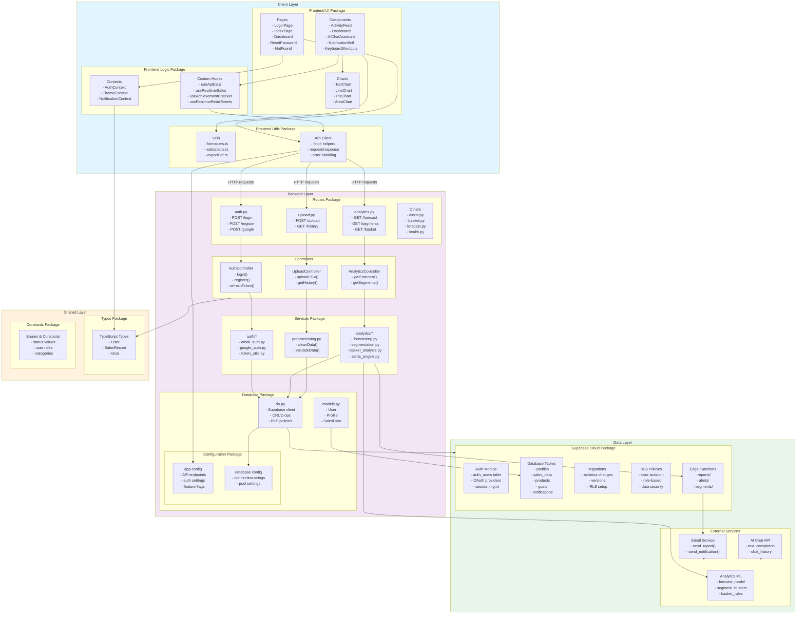

**Package Diagram Legend:**
- **Client Layer (Blue)**: React frontend, UI components, contexts, hooks, utilities
- **Backend Layer (Purple)**: Flask routes, controllers, services, database layer
- **Data Layer (Green)**: Supabase (auth, tables, migrations, RLS, edge functions), external services
- **Shared Layer (Orange)**: Types, configuration, constants used across layers
- **Arrows**: Dependencies and data flow between packages
- **Solid Line Arrow**: Direct dependency/import relationship
- **Labeled Arrow (HTTP requests)**: Network communication

## 11) Deployment Diagram
```mermaid
graph TB
    subgraph ClientLayer["Client Layer"]
        subgraph Devices["User Devices"]
            Desktop["💻 Desktop Browser<br/>Chrome/Firefox/Safari"]
            Mobile["📱 Mobile Browser<br/>iOS/Android"]
            Tablet["📲 Tablet Browser"]
        end
    end

    subgraph CDNLayer["CDN & Edge"]
        CDN["🌐 Content Delivery Network<br/>- Static Assets<br/>- SPA Bundle<br/>- Images/Media"]
    end

    subgraph FrontendLayer["Frontend Hosting"]
        subgraph FEServer["Web Server (Vercel/Netlify/AWS S3+CloudFront)"]
            ReactVite["React + Vite SPA<br/>- index.html<br/>- main.tsx<br/>- CSS bundles<br/>- JS chunks"]
            EnvConfig["Environment Config<br/>- API_URL<br/>- AUTH_DOMAIN<br/>- Feature Flags"]
        end
    end

    subgraph BackendLayer["Backend Deployment (Cloud Run/Heroku/AWS EC2)"]
        subgraph APIServer["Flask API Server (Python 3.9+)"]
            AuthRoute["auth.py<br/>- POST /login<br/>- POST /register<br/>- POST /refresh"]
            UploadRoute["upload.py<br/>- POST /upload<br/>- GET /history"]
            AnalyticsRoute["analytics.py<br/>- GET /forecast<br/>- GET /segments<br/>- GET /basket<br/>- GET /alerts"]
            HealthRoute["health.py<br/>- GET /health"]
        end

        subgraph AppServices["Application Services"]
            AuthSvc["Email Auth Service<br/>- email_auth.py<br/>- google_auth.py<br/>- token_utils.py"]
            AnalyticsSvc["Analytics Engine<br/>- forecasting.py<br/>- segmentation.py<br/>- basket_analysis.py<br/>- alerts_engine.py"]
            PreprocessSvc["Preprocessing Service<br/>- cleanData()<br/>- validateData()"]
            RepoLayer["Repository Layer<br/>- db.py<br/>- Supabase Client<br/>- CRUD Operations<br/>- RLS Enforcement"]
        end

        subgraph Workers["Background Workers & Schedulers"]
            APScheduler["APScheduler<br/>- scheduled_report_job<br/>- analytics_refresh<br/>- alert_check"]
            CeleryWorker["Celery Workers (optional)<br/>- long-running analytics<br/>- bulk CSV processing"]
        end

        subgraph MLPipeline["ML/Analytics Pipeline"]
            DataLoader["Data Loader<br/>- read sales_data<br/>- pandas DataFrame"]
            FeatureEng["Feature Engineering<br/>- time series features<br/>- aggregations"]
            Models["Trained Models<br/>- forecast_model.pkl<br/>- kmeans_segments.pkl<br/>- apriori_rules.pkl"]
        end
    end

    subgraph DataLayer["Supabase Cloud (Managed PostgreSQL)"]
        subgraph AuthSys["Authentication System"]
            SupabaseAuth["Supabase Auth Service<br/>- auth_users table<br/>- OAuth Providers<br/>- Session Management<br/>- JWT Tokens"]
        end

        subgraph Database["PostgreSQL Database"]
            CoreTables["Core Tables<br/>- auth_users<br/>- profiles<br/>- sales_data<br/>- products"]
            AnalyticsTables["Analytics Tables<br/>- goals<br/>- achievements<br/>- notifications<br/>- activity_log"]
            TransactionTables["Transaction Tables<br/>- pos_transactions<br/>- pos_transaction_items<br/>- upload_history"]
            ChatTables["Chat Tables<br/>- chat_messages<br/>- conversation_id index"]
            ReportTables["Reporting Tables<br/>- scheduled_reports"]
        end

        subgraph RealtimeDB["Realtime & Subscriptions"]
            RealtimeListeners["Realtime Listeners<br/>- sales_data updates<br/>- notification broadcasts<br/>- goal progress"]
        end

        subgraph RLS["Row Level Security (RLS)"]
            RLSPolicies["RLS Policies<br/>- user isolation<br/>- role-based access<br/>- data protection"]
        end

        subgraph Storage["Cloud Storage"]
            CSVStorage["CSV Upload Storage<br/>- raw files<br/>- processed files<br/>- backups"]
            ReportStorage["Report Storage<br/>- PDF exports<br/>- cached reports"]
        end

        subgraph EdgeFunctions["Edge Functions (Supabase Functions)"]
            ReportFunction["reports/<br/>- generate_report()<br/>- format_email"]
            AlertFunction["alerts/<br/>- check_alerts()<br/>- notify_user"]
            SegmentFunction["segments/<br/>- compute_clusters()<br/>- save_results"]
            AuthFunction["auth/<br/>- email_verification<br/>- password_reset"]
        end
    end

    subgraph ExternalServices["External Services & APIs"]
        subgraph EmailProvider["Email Service"]
            SMTPGateway["SMTP/API Gateway<br/>- SendGrid/AWS SES<br/>- Email Templating<br/>- Delivery Tracking"]
        end

        subgraph AIChatAPI["AI Chat Service"]
            OpenAI["OpenAI API / Hugging Face<br/>- text-davinci<br/>- chat completions<br/>- embeddings"]
        end

        subgraph AnalyticsExternal["Analytics & Monitoring"]
            DataStudio["Google Data Studio<br/>- Dashboard Templates<br/>- Report Visualization"]
            SupabaseMonitor["Supabase Monitoring<br/>- Database Metrics<br/>- API Analytics"]
        end
    end

    subgraph Monitoring["Monitoring & Infrastructure"]
        subgraph Logs["Logging"]
            CloudLogging["Cloud Logging<br/>- API request logs<br/>- Error logs<br/>- Analytics logs<br/>- Supabase audit logs"]
        end

        subgraph Metrics["Metrics & Alerting"]
            PrometheusGrafana["Prometheus/Grafana<br/>- API response times<br/>- Database query times<br/>- Worker status<br/>- Error rates"]
        end

        subgraph CI_CD["CI/CD Pipeline"]
            GitHub["GitHub Actions<br/>- Build & Test<br/>- Deploy Frontend<br/>- Deploy Backend<br/>- Run Migrations<br/>- Health Checks"]
        end
    end

    subgraph Environments["Environments"]
        subgraph Dev["🔧 Development"]
            DevFE["Dev Frontend<br/>localhost:5173"]
            DevAPI["Dev Backend<br/>localhost:8000"]
            DevDB["Dev Supabase<br/>Branch/Local DB"]
        end

        subgraph Staging["🚀 Staging"]
            StagingFE["Staging Frontend<br/>staging.retailmind.dev"]
            StagingAPI["Staging Backend<br/>api-staging.retailmind.dev"]
            StagingDB["Staging Supabase<br/>Branch Database"]
        end

        subgraph Production["⭐ Production"]
            ProdFE["Production Frontend<br/>retailmind.dev<br/>CDN Distribution"]
            ProdAPI["Production Backend<br/>api.retailmind.dev<br/>Auto-scaling"]
            ProdDB["Production Supabase<br/>Main Database<br/>Backups/HA"]
        end
    end

    %% Client to Frontend
    Desktop --> CDN
    Mobile --> CDN
    Tablet --> CDN
    CDN --> ProdFE

    %% Frontend to API
    ProdFE --> ProdAPI
    ProdFE --> SupabaseAuth

    %% API to Services
    ProdAPI --> AuthSvc
    ProdAPI --> AnalyticsSvc
    ProdAPI --> PreprocessSvc
    ProdAPI --> RepoLayer

    %% Services to Database
    AuthSvc --> RepoLayer
    AnalyticsSvc --> RepoLayer
    PreprocessSvc --> RepoLayer
    RepoLayer --> AuthSys
    RepoLayer --> CoreTables
    RepoLayer --> AnalyticsTables
    RepoLayer --> TransactionTables
    RepoLayer --> ChatTables
    RepoLayer --> ReportTables

    %% Background Workers
    APScheduler --> AnalyticsSvc
    APScheduler --> SMTPGateway
    CeleryWorker --> PreprocessSvc

    %% ML Pipeline
    AnalyticsSvc --> DataLoader
    DataLoader --> FeatureEng
    FeatureEng --> Models
    Models --> AnalyticsSvc

    %% Edge Functions
    EdgeFunctions --> CoreTables
    EdgeFunctions --> SMTPGateway
    EdgeFunctions --> AlertFunction

    %% External Services
    ProdAPI --> OpenAI
    ProdAPI --> SMTPGateway
    EdgeFunctions --> SMTPGateway
    ProdFE --> DataStudio

    %% Realtime
    RealtimeListeners --> ProdFE

    %% Monitoring
    ProdAPI --> CloudLogging
    ProdDB --> CloudLogging
    ProdAPI --> PrometheusGrafana
    GitHub --> ProdFE
    Github --> ProdAPI
    GitHub --> ProdDB

    %% Environment relationships
    DevFE -.->|mirrors| StagingFE
    StagingFE -.->|promotes to| ProdFE
    DevAPI -.->|mirrors| StagingAPI
    StagingAPI -.->|promotes to| ProdAPI
    DevDB -.->|mirrors| StagingDB
    StagingDB -.->|promotes to| ProdDB

    %% Styling
    style ClientLayer fill:#e3f2fd
    style CDNLayer fill:#f3e5f5
    style FrontendLayer fill:#e8f5e9
    style BackendLayer fill:#fff3e0
    style DataLayer fill:#fce4ec
    style ExternalServices fill:#f1f8e9
    style Monitoring fill:#ede7f6
    style Environments fill:#e0f2f1
```

**Deployment Diagram Legend:**

**Layers & Components:**
- **Client Layer (Blue)**: Web browsers on various devices
- **CDN & Edge (Purple)**: Content delivery network for static assets
- **Frontend Hosting (Green)**: React SPA deployment on Vercel/Netlify/AWS
- **Backend Deployment (Orange)**: Flask API with services, workers, and ML pipeline
- **Supabase Cloud (Pink)**: PostgreSQL database with auth, RLS, realtime, storage, edge functions
- **External Services (Light Green)**: Email, AI Chat, Analytics integrations
- **Monitoring (Light Purple)**: Logging, metrics, CI/CD pipeline
- **Environments (Teal)**: Dev/Staging/Production deployment targets

**Key Features Shown:**
- ✅ Complete technology stack (React, Flask, PostgreSQL, Supabase)
- ✅ All 13 database tables distributed across 5 table groups
- ✅ All routes (auth, upload, analytics, health)
- ✅ All services (auth, analytics, preprocessing, repository)
- ✅ Background workers (APScheduler, Celery optional)
- ✅ ML pipeline (data loader, feature engineering, trained models)
- ✅ Edge functions (reports, alerts, segments, auth)
- ✅ External integrations (Email, AI Chat, Data Studio)
- ✅ Realtime subscriptions for live updates
- ✅ RLS policies for security
- ✅ Cloud storage for files
- ✅ Monitoring stack (logging, metrics, CI/CD with GitHub Actions)
- ✅ Three deployment environments (dev, staging, production)
- ✅ Auto-scaling and HA for production
- ✅ Backups and disaster recovery
- ✅ Environment promotion workflow
