# Retail Insight Hub Diagrams (Mermaid)

## 1) ERD
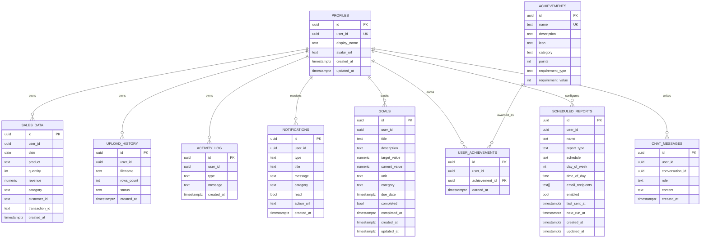

## 2) DFD Level 0 (Context)
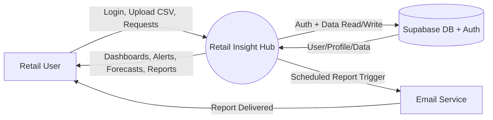

## 3) DFD Level 1
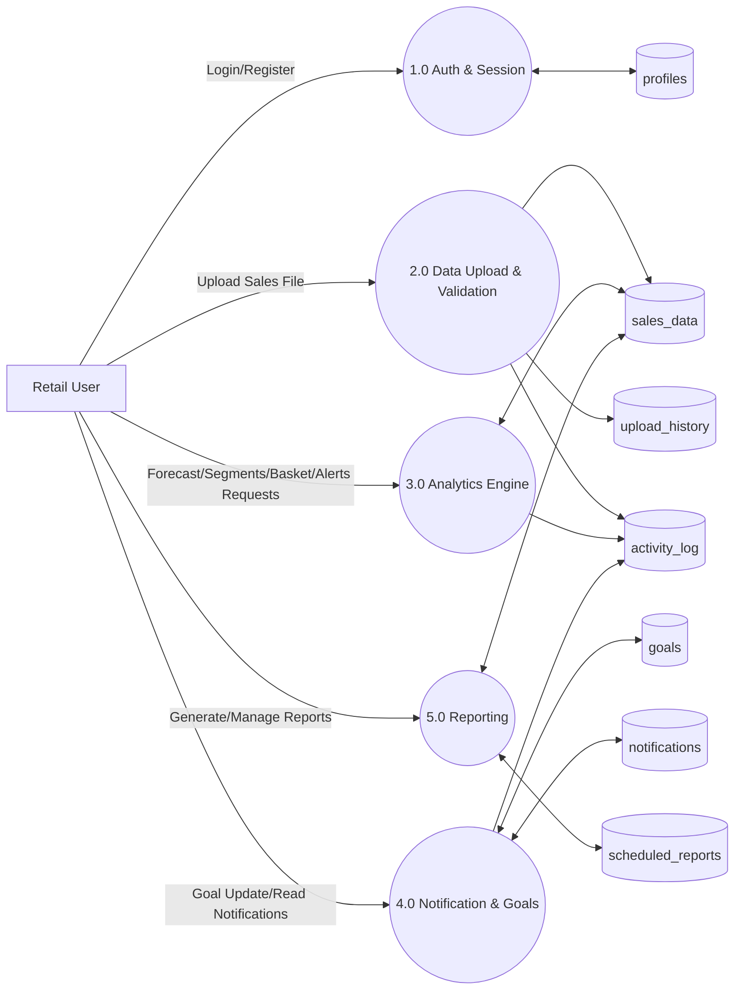

## 4) Class Diagram
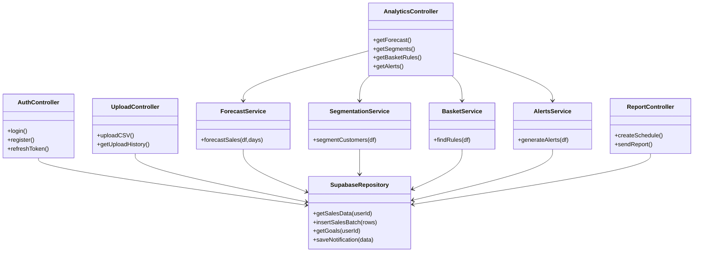

## 5) Use Case Diagram
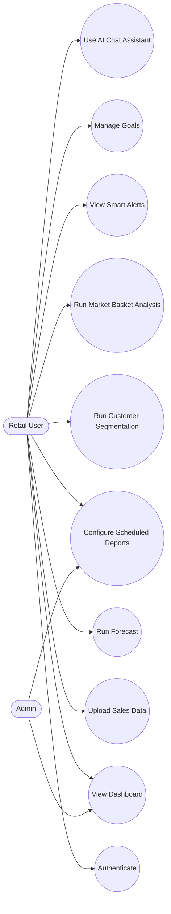

## 6) Activity Diagram
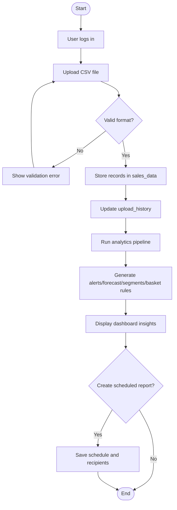

## 7) Sequence Diagram
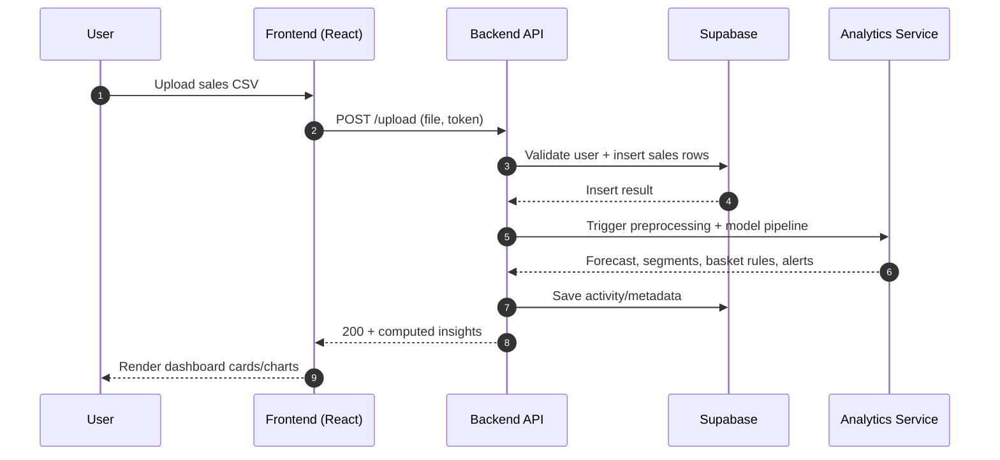

## 8) Collaboration Diagram (Communication-Style)
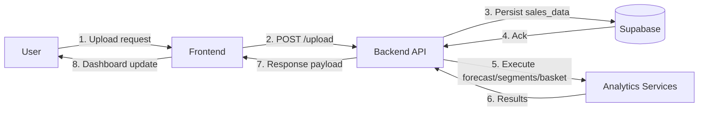

## 9) State Chart Diagram
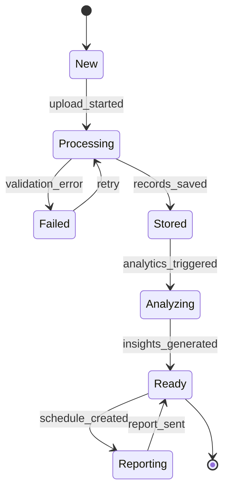

## 10) Package Diagram
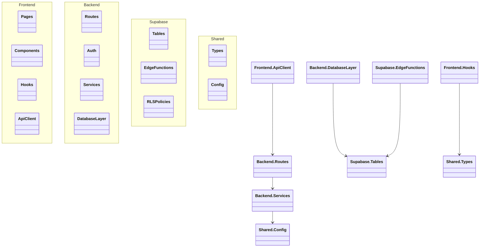

## 11) Deployment Diagram
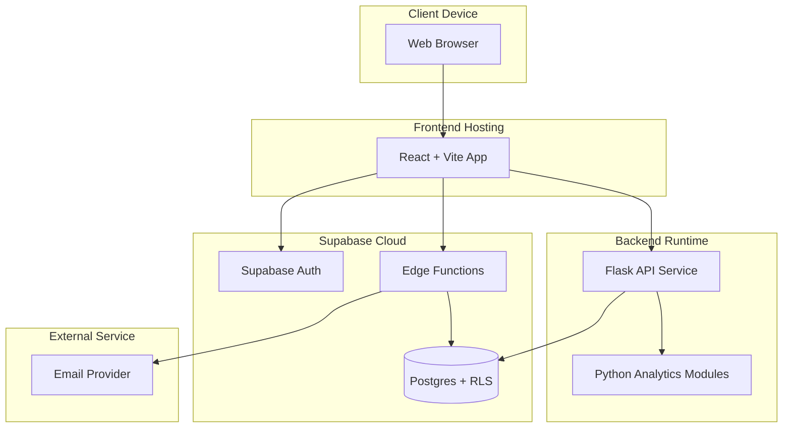

